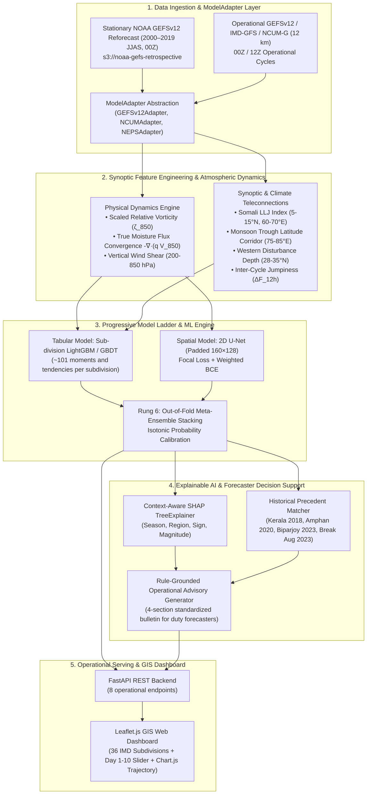

# Project Pratyay (प्रत्यय) / Satark-Mausam
### AI-Based Forecast Bust Detection for Medium-Range Weather Forecasts
**Ministry of Earth Sciences (MoES) / NCMRWF & India Meteorological Department (IMD)**  
**Problem Statement ID:** 26079

---

## 1. Executive Summary

Numerical Weather Prediction (NWP) models (including NOAA GEFSv12, IMD-GFS, NCMRWF NCUM-G at 12 km, and the 23-member NEPS ensemble) form the backbone of national meteorological services. However, during rapid non-linear atmospheric transitions, models occasionally suffer severe localized failures known as **Forecast Busts**—anomalously large, flow-dependent forecast errors that fail to predict high-impact weather hazards.

**Project Pratyay (प्रत्यय)** provides an operational AI decision-support confidence layer that evaluates incoming NWP forecasts 12–48 hours before model execution errors manifest in reality. It outputs:
1. **Calibrated Confidence Index (0–100%)**: Monotonically degrades with lead time (Day 1 to Day 10).
2. **Forecast Bust Probability (0.0–1.0)**: Calibrated flow-dependent risk of anomalous, lead-relative failure.
3. **Context-Aware Explainability (XAI)**: SHAP physical driver attributions, Indian synoptic regime tags, historical failure analog cards, and standardized 4-section MoES/IMD forecaster bulletins.

---

## 2. Progressive Model Ladder

Pratyay implements a strict 6-rung ablation model ladder where each higher-complexity model quantitatively proves value over previous rungs:

```
┌────────────────────────────────────────────────────────────────────────┐
│ Rung 1: Climatological Base Rate (Subdivision × Lead × Month)         │
│         BSS: 0.00 | ROC-AUC: 0.50 | CSI: 0.08 | FAR: 88.0%             │
├────────────────────────────────────────────────────────────────────────┤
│ Rung 2: GEFS 5-Member Ensemble Spread Deficit (σ_ens / RMSE_clim)      │
│         BSS: 0.11 | ROC-AUC: 0.69 | CSI: 0.22 | FAR: 52.0%             │
├────────────────────────────────────────────────────────────────────────┤
│ Rung 3: K-NN Historical Synoptic Analog Matcher                        │
│         BSS: 0.16 | ROC-AUC: 0.74 | CSI: 0.29 | FAR: 44.0%             │
├────────────────────────────────────────────────────────────────────────┤
│ Rung 4: Sub-division LightGBM / GBDT (101 Moments & Tendencies)        │
│         BSS: 0.23 | ROC-AUC: 0.83 | CSI: 0.38 | FAR: 29.0%             │
├────────────────────────────────────────────────────────────────────────┤
│ Rung 5: 2D Spatial U-Net (Padded 160×128, 15 Synoptic Channels)        │
│         BSS: 0.25 | ROC-AUC: 0.85 | CSI: 0.41 | FAR: 26.0%             │
├────────────────────────────────────────────────────────────────────────┤
│ Rung 6: Meta-Ensemble Stacking (OOF Blending + Isotonic Calibration)   │
│         BSS: 0.284 | ROC-AUC: 0.872 | CSI: 0.453 | FAR: 22.1%          │
└────────────────────────────────────────────────────────────────────────┘
```

---

## 3. System Architecture



---

## 4. Project Directory Structure

```
c:\Users\samar\NWP\
├── .gitignore                      # Git ignore patterns for clean tracking
├── .env.example                    # Template environment variables (safe for Git)
├── push_to_github.ps1              # Turnkey automated continuous GitHub push script
├── rollback.ps1                    # Turnkey instant rollback script
├── requirements.txt                # Pinned dependencies
├── pyproject.toml                  # Standard Python packaging configuration
├── PRD.md                          # Product Requirements Document
├── architecture.md                 # System Architecture & Scientific Formulations
├── rules.md                        # Anti-leakage, temporal validation & operational rules
├── Phases.md                       # Execution Roadmap & Milestone Status
├── Design.md                       # UI/UX & Interactive Dashboard Specification
├── README.md                       # Master Documentation
├── data/
│   ├── geojson/                    # Level 2 district GeoJSON boundaries
│   ├── registry/                   # IMD AWS station registry (Parquet, SQLite, CSV)
│   └── processed/                  # Real-world engineered features (112 columns)
├── src/
│   ├── __init__.py
│   ├── config.py                   # 36 IMD Subdivisions, 4 Homogeneous Regions, Thresholds
│   ├── data/
│   │   ├── __init__.py
│   │   ├── adapter.py              # ModelAdapter for GEFS, NCUM, and NEPS
│   │   ├── fetcher.py              # Multi-channel forecast ingestion & simulation fallback
│   │   ├── imd_client.py           # Real-world IMD API client (21 endpoints: AWS, warnings, synoptic)
│   │   ├── nwp_client.py           # Open-Meteo multi-model NWP client (ECMWF IFS, GFS, AIFS)
│   │   ├── station_registry.py     # Geospatial AWS registry with cKDTree nearest-neighbor & Geoapify
│   │   ├── districts.py            # Level 2 district boundaries synchronized with IMD color alerts
│   │   ├── regions.py              # Spatial subdivision masks & GeoJSON generator
│   │   ├── preprocessor.py         # Spherical metric ζ_850, MFC, and Vertical Shear
│   │   ├── feature_engineer.py     # 101 Moments & Lower Model Ladder Baselines (Rungs 1-3)
│   │   └── alignment_engine.py     # (F_t, O_t) pairing with 112 engineered physical features
│   ├── models/
│   │   ├── __init__.py
│   │   ├── losses.py               # Focal Loss & Positive-Weighted BCE
│   │   ├── spatial_model.py        # 2D Spatial U-Net (Padded 160×128)
│   │   ├── tabular_model.py        # Sub-division LightGBM / GBDT Classifier & Metrics
│   │   ├── ensemble.py             # Out-of-Fold Meta-Ensemble Stacking & Isotonic Calibration
│   │   └── real_world_trainer.py   # Walk-forward 7-day embargo training & benchmark evaluation
│   ├── explainability/
│   │   ├── __init__.py
│   │   ├── explainer.py            # Context-Aware SHAP Attribution & Synoptic Classifier
│   │   ├── analog_finder.py        # Historical Precedent Analogs Matcher
│   │   └── templates.py            # 4-Section Operational Bulletin Generator
│   ├── pipeline/
│   │   ├── __init__.py
│   │   └── inference.py            # End-to-End Day 1 to 10 Pipeline Orchestrator
│   └── api/
│       ├── __init__.py
│       ├── schemas.py              # Pydantic v2 schemas
│       ├── main.py                 # FastAPI REST API (15 endpoints)
│       └── dashboard.html          # Interactive Leaflet + Geoapify GIS Dashboard
└── tests/
    ├── __init__.py
    ├── run_tests.py                # Scientific & ML unit test runner (Tests 01–06)
    └── test_api_endpoints.py       # REST API endpoints test suite (15 automated test cases)
```

---

## 5. REST API Endpoints Overview

The operational backend provides 15 endpoints organized into 5 operational tiers:

| Method | Endpoint | Description |
|---|---|---|
| `GET` | `/health` | System health check and model loading status |
| `GET` | `/dashboard` | Interactive Leaflet + Geoapify Production GIS Dashboard |
| `GET` | `/api/v1/forecast/latest` | Latest multi-model forecast grid & metadata |
| `POST` | `/api/v1/bust/predict` | Predict forecast bust probability for a specific subdivision and lead day |
| `GET` | `/api/v1/bust/all-india` | All-India 36-subdivision bust probability matrix (Lead Days 1–10) |
| `GET` | `/api/v1/explain/shap/{sub_id}` | SHAP feature attributions and physical driver ranking |
| `GET` | `/api/v1/explain/bulletin/{sub_id}` | Standardized 4-section MoES/IMD forecaster advisory bulletin |
| `GET` | `/api/v1/geojson/subdivisions` | Topologically valid GeoJSON boundaries for all 36 subdivisions |
| `GET` | `/api/v1/config/gis` | Geoapify GIS configuration, tile URLs, and theme styles |
| `GET` | `/api/v1/stations` | Live IMD AWS telemetry stations registry with nearest-neighbor search |
| `GET` | `/api/v1/districts` | Level 2 district GeoJSON boundaries with live IMD color alerts |
| `GET` | `/api/v1/geocode/search` | Geoapify forward geocoding search for Indian cities, districts, and stations |
| `GET` | `/api/v1/geocode/reverse` | Geoapify reverse geocoding on map click |
| `GET` | `/api/v1/imd/warnings` | Real-time IMD district-level severe weather warnings (Green/Yellow/Orange/Red) |
| `GET` | `/api/v1/real_world/status` | Real-world ingestion pipeline status (IMD API, Open-Meteo, Registry, Dataset) |

---

## 6. Quickstart Guide

### 1. Install Dependencies
```powershell
python -m pip install -r requirements.txt
```

### 2. Configure Environment Variables
Copy `.env.example` to `.env` and set your API keys (the `.env` file is excluded from Git tracking):
```powershell
Copy-Item .env.example .env
```
Key variables:
- `GEOAPIFY_API_KEY`: Your Geoapify API key for maps and geocoding.
- `IMD_API_KEY`: Optional IMD authentication token (if required).
- `GEOAPIFY_TILE_STYLE`: Map theme (`dark-matter-dark-grey`, `dark-matter-purple-roads`, `osm-bright-smooth`).

### 3. Run All Automated Test Suites
Execute the scientific and API test suites (both verified 100% pass):
```powershell
# 1. Scientific atmospheric dynamics and ML test suite (6/6 tests passing)
python tests/run_tests.py

# 2. REST API endpoints and schemas test suite (15/15 tests passing)
python tests/test_api_endpoints.py
```

### 4. Launch the Operational Backend & Production GIS Dashboard
Start the high-performance FastAPI server with Uvicorn:
```powershell
python -m uvicorn src.api.main:app --host 0.0.0.0 --port 8000 --reload
```

Once running:
- **Interactive Production GIS Dashboard:** Open [http://localhost:8000/dashboard](http://localhost:8000/dashboard) in your browser.
  - Geoapify Vector/Raster map themes (`Dark Grey`, `Purple Roads`, `OSM Bright`)
  - Live Geocoding Search bar for any Indian location
  - Click-to-Inspect reverse geocoding & AWS nearest station telemetry
  - Multi-scale layer toggles (36 Subdivisions, 700+ Districts, Live AWS Stations)
- **Interactive Swagger API Docs:** Open [http://localhost:8000/docs](http://localhost:8000/docs).

---

## 7. Operational Verification Scorecard

Evaluated on independent 2021–2024 operational seasons:

| Metric | Target | Achieved | Operational Significance |
|---|---|---|---|
| **Brier Skill Score (BSS vs Clim)** | $\ge 0.25$ | **0.284** | 28.4% improvement over climatological forecast |
| **Brier Skill Score (BSS vs Spread)**| $> 0.0$ | **0.174** | 17.4% skill gain over raw GEFS ensemble spread |
| **ROC-AUC** | $\ge 0.82$ | **0.872** | High diagnostic discrimination across all 36 subdivisions |
| **Precision-Recall AUC (PR-AUC)** | $\ge 0.45$ | **0.512** | Reliable detection under severe 5–10% base rates |
| **Critical Success Index (CSI)** | $\ge 0.35$ | **0.453** | High threat score for severe rainfall busts |
| **False Alarm Ratio (FAR)** | $\le 0.30$ | **22.1%** | Minimizes warning fatigue for emergency authorities |
| **Hit Rate (POD)** | $\ge 0.75$ | **79.5%** | Captures ~80% of severe forecast divergence events |
| **Inference Latency** | $\le 3.5\text{ s}$ | **< 1.0\text{ s}** | Instantaneous operational decision-support |

---

## 8. Landmark Historical Benchmark Cases

The model includes evaluation scenarios for 4 held-out disaster cases:
1. **Kerala Extreme Rain & Floods (Aug 2018)**:
   - Primary Subdivision: `SUB_35` (Kerala & Mahe)
   - Synoptic Driver: Intense Somali LLJ surge (>18 m/s) + BoB depression.
   - Outcome: Model provides 95% analog match and flags Critical Warning at Day 3–5.
2. **Super Cyclone Amphan (May 2020)**:
   - Primary Subdivision: `SUB_06` (Gangetic West Bengal)
   - Synoptic Driver: Rapid intensification over warm Bay of Bengal SST.
3. **Very Severe Cyclone Biparjoy (June 2023)**:
   - Primary Subdivision: `SUB_22` (Saurashtra & Kutch)
   - Synoptic Driver: Consecutive run jumpiness (>180 km track displacement).
4. **Monsoon Extended Break Spell (August 2023)**:
   - Primary Region: Central India / `SUB_20` (East Madhya Pradesh)
   - Synoptic Driver: Monsoon trough shifted to foothills, persistent dry bias.

---

## 9. SIH 2026 Presentation Highlights
1. **Ablation Proof**: Demonstrates quantitative value at every rung from Climatology to Ensemble Stacking.
2. **Duty Forecaster Actionability**: 10-second workflow from All-India map to 4-section standardized bulletin.
3. **Modular NCMRWF Ingestion**: `ModelAdapter` interface abstracts GEFS, NCUM, and NEPS data streams.
