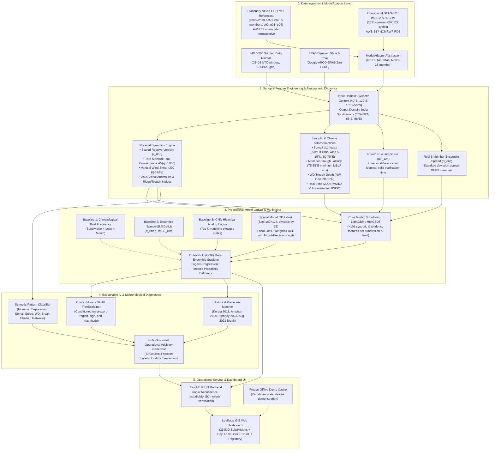

# PART II: Architecture & Technical Design

## 1. End-to-End System Architecture

Pratyay is architected as an operational AI decision-support system designed to interface directly with Numerical Weather Prediction (NWP) model outputs from NCMRWF/IMD and generate calibrated confidence assessments.



---

## 2. Atmospheric & Scientific Formulations

### 2.1 Spatial Domain Specifications
- **Input Domain (Feature Extraction):** $40^\circ\text{E}–120^\circ\text{E}, 15^\circ\text{S}–50^\circ\text{N}$ (to capture upstream Mediterranean/Caspian Western Disturbances, equatorial Indian Ocean MJO wave activity, and Bay of Bengal/Arabian Sea tropical cyclogenesis).
- **Target Output & Verification Domain:** $5^\circ\text{N}–38^\circ\text{N}, 68^\circ\text{E}–98^\circ\text{E}$ (Indian Subcontinent and immediate coastal waters; 36 IMD Subdivisions).

### 2.2 Physical Dynamic Derivations (Spherical Coordinates)
1. **Scaled Relative Vorticity ($\zeta_{850}$):**
   $$\zeta_{850} = \frac{1}{R\cos\phi}\left(\frac{\partial v_{850}}{\partial\lambda} - \frac{\partial(u_{850}\cos\phi)}{\partial\phi}\right) \times 10^5 \quad [\text{s}^{-1}]$$
   where $R = 6.371 \times 10^6\text{ m}$, $\phi = \text{latitude}$, $\lambda = \text{longitude}$.

2. **True Moisture Flux Convergence (MFC):**
   $$\text{MFC} = -\nabla \cdot (q_{850} \vec{V}_{850}) = -\left[\frac{1}{R\cos\phi}\frac{\partial(q_{850} u_{850})}{\partial\lambda} + \frac{1}{R\cos\phi}\frac{\partial(q_{850} v_{850}\cos\phi)}{\partial\phi}\right]$$
   Computed using specific humidity $q_{850}$ (kg/kg) rather than relative humidity.

3. **Vertical Wind Shear ($200–850\text{ hPa}$):**
   $$\text{Shear} = \sqrt{(u_{200} - u_{850})^2 + (v_{200} - v_{850})^2} \quad [\text{m/s}]$$

4. **Somali Low-Level Jet (LLJ) Index:**
   $$\text{LLJ Index} = \frac{1}{A_{\text{box}}}\iint_{5^\circ\text{N}–15^\circ\text{N}, 60^\circ\text{E}–70^\circ\text{E}} u_{850}(\lambda, \phi) \, d\lambda d\phi \quad [\text{m/s}]$$

5. **Run-to-Run Jumpiness (Forecast Tendency for Same Valid Time):**
   $$\Delta F_{12\text{h}}(s, t+\tau) = |F_{\text{init}=t}(s, t+\tau) - F_{\text{init}=t-12\text{h}}(s, t+\tau)|$$

---

## 3. Statistical Bust Labeling & Dual-Output Architecture

### 3.1 Statistically Rigorous Bust Definitions
Rather than applying Gaussian $2\sigma$ assumptions on skewed precipitation, Pratyay employs **operational categorical criteria** and **non-parametric percentile thresholds** derived strictly from training years (2000–2019):

#### A. Categorical Rainfall Busts (IMD Operational Scale)
- **Heavy Rain Miss (Under-forecast Bust):** Observed Rainfall $\ge 64.5\text{ mm/day}$ (IMD Heavy Rain) while NWP Forecast $< 35.5\text{ mm/day}$.
- **False Alarm Bust (Over-forecast Bust):** NWP Forecast $\ge 64.5\text{ mm/day}$ while Observed Rainfall $< 15.5\text{ mm/day}$.
- **Extreme Event Miss:** Observed Rainfall $\ge 115.6\text{ mm/day}$ (IMD Very Heavy Rain) with $<50\%$ forecast capture.

#### B. Continuous Error Busts ($P_{90}$ Percentile Standardized)
$$\text{Bust Label } Y(s, \text{month}, \tau) = \begin{cases} 1 & \text{if } |F - O| \ge P_{90}\left(|F_{\text{train}} - O_{\text{train}}|\right)_{s, \text{month}, \tau} \\ 0 & \text{otherwise} \end{cases}$$

### 3.2 Dual Output Formulation
To prevent the mathematical paradox where lead-dependent error normalization flattens risk curves:
1. **Forecast Confidence Index ($0–100\%$):** Calibrated probability that error remains within absolute operational tolerance. **Naturally and monotonically degrades from Day 1 to Day 10**.
2. **Forecast Bust Probability ($0.0–1.0$):** Calibrated probability of an anomalous, flow-dependent failure relative to the expected error at that specific lead time.

---

## 4. Machine Learning Engine & Progressive Model Ladder

Pratyay implements an **ablation model ladder** where each higher-complexity model must quantitatively prove value over the previous rung:

```
Rung 1: Climatological Base Rate (Subdivision × Lead × Month)
   ↓
Rung 2: GEFS 5-Member Ensemble Spread-Skill Deficit (σ_ens / RMSE_clim)
   ↓
Rung 3: K-NN Historical Analog Engine (K=10 nearest synoptic states)
   ↓
Rung 4: LightGBM / HistGradientBoosting Classifier (101 subdivision features)
   ↓
Rung 5: 2D Spatial U-Net (Size 160×128, padded, divisible by 32)
   ↓
Rung 6: Meta-Ensemble Stacking (Trained on Out-of-Fold predictions + Isotonic Calibration)
```

### 4.1 Tabular Feature Vector (~101 Features per Subdivision)
- **Forecast Summary Moments (4 × 10 vars = 40):** Mean, std, max, 90th percentile of $Z_{500}, T_{2\text{m}}, T_{850}, \text{MSLP}, \text{APCP}, q_{850}, u_{850}, v_{850}, \text{PWAT}, \text{Shear}$ over the subdivision mask.
- **Log-Transformed Precipitation Moments (4):** $\log(1 + \text{APCP})$ moments.
- **Inter-Cycle Tendency / Jumpiness (6):** $\Delta F_{12\text{h}}$ for $Z_{500}, \text{MSLP}, \text{APCP}, u_{850}$.
- **Real Ensemble Spread (10):** Standard deviation across GEFS members for 10 atmospheric channels.
- **Indian Climate & Synoptic Indices (8):** Somali LLJ Index, Monsoon Trough Latitude, WD Depth Index, MJO Amplitude & Phase, BSISO Index.
- **Temporal & Topographic (5):** $\sin/\cos(\text{DOY})$, Lead Day $\tau \in [1, 10]$, subdivision centroid lat/lon.

### 4.2 Spatial U-Net Model
- **Input Tensor:** $(B, 15, 160, 128)$ — 15 dynamic channels padded from $133 \times 121$ to multiples of 32.
- **Encoder:** 4-level contracting path with LeakyReLU activations and $25\%$ spatial dropout.
- **Loss Function:** `BCEWithLogitsLoss(pos_weight=8.0)` executed in mixed precision, followed by post-hoc Isotonic Regression calibration.

### 4.3 Validation & Anti-Leakage Protocol
- **Temporal Splitting:** Training on 2000–2019 GEFSv12 Reforecast (JJAS, 1,220–2,440 init dates); testing on 2021–2024 operational GEFS.
- **Cross-Validation:** Blocked Leave-One-Season-Out (LOSO) across 20 monsoon seasons.
- **Embargo Gap:** $\ge 10\text{ days}$ buffer between training and evaluation partitions.
- **Benchmark Isolation:** Landmark case studies (*Kerala 2018*, *Amphan 2020*, *Biparjoy 2023*, *August 2023 Monsoon Break*) are completely held out from model fitting.

---

## 5. Model-Agnostic Interface (`ModelAdapter`)

To facilitate seamless integration into NCMRWF operations, the system abstracts model ingestion behind a unified interface:

```python
from abc import ABC, abstractmethod
import xarray as xr

class ModelAdapter(ABC):
    """Abstract interface for NWP model data ingestion."""
    
    @abstractmethod
    def fetch_forecast(self, init_time, lead_hours: list) -> xr.Dataset:
        """Standardizes forecast fields to canonical grid and variables."""
        pass
        
    @abstractmethod
    def get_ensemble_spread(self, init_time, lead_hours: list) -> xr.Dataset:
        """Computes ensemble standard deviation across available members."""
        pass

class GEFSv12Adapter(ModelAdapter):
    """Adapter for NOAA GEFSv12 reforecast and operational data streams."""
    ...

class NCUMAdapter(ModelAdapter):
    """Adapter for NCMRWF Global Unified Model (NCUM-G 12 km)."""
    ...

class NEPSAdapter(ModelAdapter):
    """Adapter for NCMRWF Ensemble Prediction System (NEPS 23-member 12 km)."""
    ...
```

---

## 6. Explainable AI & Forecaster Decision Support

Pratyay combines 3 complementary XAI methods:

| Method | Mechanism | Forecaster Utility |
|---|---|---|
| **Context-Aware SHAP** | TreeExplainer on LightGBM features, filtered by season, region, sign, and magnitude | Identifies specific physical instability factors (e.g. *Somali LLJ mismatch +42% risk*) |
| **Historical Precedent Analogs** | K-NN search in 20-year error database | Grounding in documented historical events (e.g., *Similar to August 2020 Konkan Extreme Rain*) |
| **Synoptic Pattern Tags** | Deterministic synoptic rule classifier | Explicit identification of active regimes (WD, BoB Depression, Monsoon Break) |
| **Natural Language Advisory** | Structured rule-based template engine | Standardized 4-section MoES/IMD bulletin text |

---

## 7. Verification Metrics Suite

Evaluated on independent 2021–2024 test seasons:
- **Brier Skill Score (BSS):** Relative to climatology baseline and ensemble spread baseline.
- **Precision-Recall AUC (PR-AUC):** High-reliability evaluation under severe 5–10% base rates.
- **Critical Success Index (CSI) / Threat Score:** $\text{CSI} = \frac{\text{Hits}}{\text{Hits} + \text{Misses} + \text{False Alarms}}$ by lead day.
- **Fractions Skill Score (FSS):** Spatial neighborhood verification avoiding point double-penalty.
- **Reliability Diagrams:** Plotted across 10 probability bins for Day 1, Day 3, Day 5, Day 7, Day 10.

---