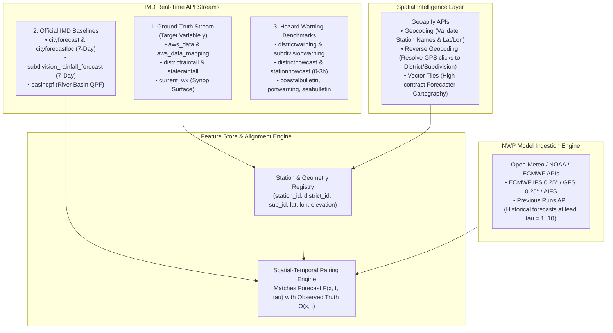

# Project Pratyay (प्रत्यय) / Satark-Mausam
## Engineering & Operational Upgrade Specification: Real-World Data & Production GIS
**Document:** `update.md`  
**Target Platform:** MoES / NCMRWF / IMD Operational Decision Support System  
**Status:** Approved for Implementation

---

## 1. Executive Summary & Objective

This document outlines the architectural and engineering migrations required to transition Project Pratyay from synthetic/reanalysis-based demonstrations to an **end-to-end real-world operational system**. 

The two primary pillars of this upgrade are:
1. **Model Training & Verification on Live Ground Truth**: Transitioning from pure static archives to live streaming Automatic Weather Station (AWS) data, gridded observations, and operational alerts through official IMD APIs coupled with global NWP forecast archives (Open-Meteo / ECMWF IFS / NOAA GFS).
2. **Production GIS & Cartographic Realism**: Replacing placeholder tile endpoints with **Geoapify Vector & Raster Tiles**, high-precision geocoding, reverse geocoding, and synchronized multi-level administrative boundaries (36 IMD Subdivisions, 700+ Districts, and individual AWS station coordinates).

---

## 2. Component Migration Matrix

| Subsystem | Previous State | Target Production State |
|---|---|---|
| **Ground Truth Ingestion** | Static ERA5 / IMD 0.25° historical NetCDFs | Real-time IMD API suite (`aws_data`, `districtrainfall`, `staterainfall`, `current_wx`) |
| **Operational Forecasts** | Simulated/cached forecast tensors | Programmatic NWP ingestion via Open-Meteo API (ECMWF IFS 9 km, NOAA GFS 0.25°, ECMWF AIFS) |
| **Operational Benchmarks** | Theoretical climatological base rates | Official IMD forecast & hazard feeds (`cityforecastloc`, `districtwarning`, `subdivisionwarning`) |
| **Map Base Layers** | Generic CartoDB dark tile layer | High-resolution **Geoapify Dark/Matter Vector Tiles** with customizable styles |
| **Spatial Matching** | Approximation via bounding boxes | **Geoapify Geocoding API** + Scipy KDTree for exact coordinate validation and polygon containment |
| **Feature Store & Registry** | Hardcoded subdivision centroid list | Station & District Registry DB with dynamic lat/lon lookup and elevation metadata |

---

## 3. Data Architecture & Pipeline Upgrades

### 3.1 IMD Official API Ingestion Hierarchy

The IMD API catalog is structured into three functional pipelines:



---

## 4. Configuration & Environment Specifications

```python
# Real-World API Configuration
GEOAPIFY_API_KEY = os.getenv("GEOAPIFY_API_KEY", "")
GEOAPIFY_TILE_STYLE = "dark-matter-dark-grey"

IMD_API_BASE_URL = os.getenv("IMD_API_BASE_URL", "https://mausam.imd.gov.in/api")
IMD_API_KEY = os.getenv("IMD_API_KEY", "")

NWP_FORECAST_PROVIDER = "open-meteo"
NWP_MODELS = ["ecmwf_ifs025", "gfs_seamless", "ecmwf_aifs025"]

# Real-World Storage Paths
STATION_REGISTRY_PATH = "data/registry/imd_aws_registry.parquet"
REAL_WORLD_FEATURE_STORE = "data/processed/features_real_world.parquet"
```
